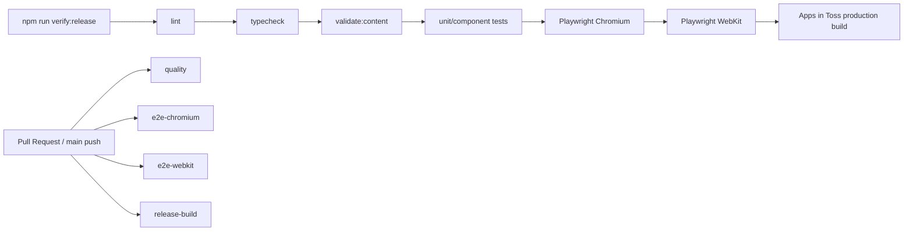

# 그때·요즘 E9 출시 게이트 설계

- 상태: 승인된 제품 설계를 구현 가능한 기술 계약으로 고정
- 작성일: 2026-07-29
- 대상 브랜치: `codex/e9-release-gate`
- 기준 커밋: `02d1edf` (`origin/main`)

## 1. 배경

그때·요즘은 출시 첫 30일의 핵심 문제 90개와 여섯 보너스 주제의 문제 90개를 갖추고, Apps in Toss Storage·Analytics·보상형 광고·공유 어댑터를 연결한 상태다. 현재 단위·컴포넌트 테스트 115개와 Apps in Toss 빌드는 통과하지만, 출시 직전의 콘텐츠 오류와 브라우저 회귀, 접근성 문제, 샌드박스 설정 누락을 한 번에 차단하는 공통 출시 계약은 없다.

E9은 앱 기능을 늘리는 단계가 아니라, 로컬과 CI가 같은 기준으로 출시 가능 여부를 판정하고 Apps in Toss 샌드박스에서만 확인 가능한 항목을 사람이 빠뜨리지 않도록 만드는 단계다.

## 2. 목표와 비목표

### 목표

1. `npm run verify:release` 한 명령으로 정적 검사, 콘텐츠 검증, 기존 테스트, 핵심 E2E, Apps in Toss 프로덕션 빌드를 재현한다.
2. Pull Request와 `main` push에서 동일한 검사를 실행하고, 모든 검사를 병합 필수 조건으로 사용한다.
3. Chromium과 WebKit에서 핵심 사용자 여정, 360px·390px 화면, 200% 텍스트 확대, 키보드 조작, 중대한 접근성 위반을 검증한다.
4. 핵심 90문제와 보너스 90문제의 출시 계약을 테스트 코드와 CLI가 공유한다.
5. 자동화할 수 없는 Apps in Toss 콘솔·QR 실기기 검증을 체크리스트로 표준화한다.
6. 실패 시 원인을 찾을 수 있도록 Playwright 보고서, 실패 스크린샷, 빌드 로그, `.ait` 산출물을 보존한다.

### 비목표

- 화면, 카피, 퀴즈 규칙, 광고 노출 정책 등 사용자 경험 변경
- 알림·리마인더 기능 구현
- Analytics 실패 이벤트를 재전송하는 outbox 구현
- Apps in Toss 콘솔로의 자동 업로드 또는 자동 출시
- 실제 운영 광고 그룹 ID나 인증 정보의 CI 저장
- 기존 의존성 취약점의 일괄 업그레이드

알림과 Analytics outbox는 E9 이후 별도 작업으로 다룬다. 의존성 보안 경고도 버전 호환성과 Apps in Toss SDK 영향을 검토하는 별도 보안 작업으로 분리한다.

## 3. 출시 계약 구조

로컬과 CI가 서로 다른 명령 조합을 갖지 않도록 `package.json`의 공개 스크립트를 단일 진입점으로 사용한다.

### 로컬 명령

`npm run verify:release`는 다음 공개 스크립트를 순서대로 실행하고 하나라도 실패하면 즉시 비정상 종료한다.

1. `npm run lint`
2. `npm run typecheck`
3. `npm run validate:content`
4. `npm run test:run`
5. `npm run test:e2e`
6. `npm run build`

개별 스크립트도 독립 실행 가능해야 한다. 개발자는 빠른 진단을 위해 일부만 실행할 수 있지만, 출시 후보 판정은 반드시 `verify:release` 전체 결과를 사용한다.

### CI 작업

`.github/workflows/release-gate.yml`은 Pull Request와 `main` push에서 아래 네 작업을 실행한다.

| 작업 | 책임 | 성공 산출물 |
| --- | --- | --- |
| `quality` | lint, typecheck, 콘텐츠 CLI, 단위·컴포넌트 테스트 | 테스트 결과와 로그 |
| `e2e-chromium` | Chromium 핵심 여정·접근성·화면 회귀 | Playwright HTML 보고서, 실패 스크린샷·trace |
| `e2e-webkit` | WebKit 핵심 여정·접근성·화면 회귀 | Playwright HTML 보고서, 실패 스크린샷·trace |
| `release-build` | Apps in Toss 프로덕션 빌드 | `geuttae-yojeum.ait`, 빌드 로그 |

네 작업은 서로 독립적으로 실행해 한 작업의 실패가 다른 진단 정보를 가리지 않게 한다. 동일 브랜치에 새 커밋이 들어오면 이전 실행은 취소한다. 모든 작업은 명시적으로 고정한 Node 버전, `npm ci`, 잠금 파일 캐시를 사용한다.

모든 작업은 병합 필수 검사다. 워크플로 파일만으로 GitHub 브랜치 보호 규칙을 만들 수 없으므로, 저장소 관리자가 `quality`, `e2e-chromium`, `e2e-webkit`, `release-build`를 `main`의 required status checks로 지정하는 절차를 출시 문서에 기록한다.

## 4. 콘텐츠 검증 계약

검증 규칙은 `src/data/content-validation.ts`의 순수 함수로 정의한다. Vitest와 `scripts/validate-content.ts`가 이 함수를 함께 사용해 테스트와 CLI 규칙의 불일치를 막는다.

### 핵심 문제

- 출시 기간은 `2026-07-28`부터 `2026-08-26`까지 연속된 30일이다.
- 매일 `then`, `now`, `life` 렌즈가 정확히 하나씩 있어 총 90문제여야 한다.
- 날짜 누락, 중복 날짜·렌즈 조합, 범위 밖 날짜를 실패로 처리한다.

### 보너스 문제

- 주제는 `nostalgia`, `korean-life`, `language`, `digital`, `safety`, `nature-general` 여섯 개다.
- 각 주제는 정확히 15문제여야 하며 총 90문제여야 한다.
- 알 수 없는 주제나 주제별 수량 부족·초과를 실패로 처리한다.

### 공통 규칙

- 모든 문제는 기존 `validateQuestion` 스키마를 통과해야 한다.
- ID는 전체 핵심·보너스 문제에서 유일해야 한다.
- 질문 문장은 공백과 대소문자를 정규화한 뒤 전체에서 유일해야 한다.
- 선택지는 세 개이고 `answerIndex`는 `0`, `1`, `2` 중 하나여야 한다.
- 출처 이름은 비어 있지 않고 출처 URL은 `https://`로 시작해야 한다.
- 핵심과 보너스 각각에서 세 정답 위치의 최대 개수와 최소 개수 차이는 2 이하여야 한다.

CLI는 한 번에 모든 문제를 검사하고, 오류마다 문제 ID 또는 날짜·주제, 위반 규칙, 실제 값을 출력한 뒤 종료 코드 1을 반환한다. 정상일 때는 핵심·보너스 문제 수와 검사 통과 사실만 짧게 출력한다.

규칙을 깨뜨린 고정 fixture를 테스트에 포함해 validator가 실제로 실패하는지 확인한다. CI에서 운영 데이터 파일을 일부러 바꾸지는 않는다.

## 5. E2E 검증

### 브라우저와 화면 행렬

- 브라우저: Chromium, WebKit
- 기본 viewport: 폭 360px와 390px
- 텍스트 확대: 각 브라우저에서 핵심 화면을 200% 텍스트 크기로 검증
- 공통 기준: 가로 스크롤 없음, 주요 버튼과 문항 내용 잘림 없음

브라우저별 CI 작업 안에서 viewport 프로젝트를 실행한다. 테스트 데이터와 시간은 고정해 현재 날짜나 실행 순서 때문에 결과가 달라지지 않게 한다.

### 핵심 여정

1. 홈에서 오늘 퀴즈를 시작해 핵심 세 문제를 풀고, 각 해설을 거쳐 결과 화면에 도달한다.
2. 첫 무료 보너스 제안에서 주제를 선택하고 보너스 세 문제를 완료한다.
3. 퀴즈 진행 중 새로고침한 뒤 저장된 위치와 답변 상태가 복원된다.
4. 일반 브라우저에서 공유 API를 사용할 수 없을 때 fallback 동작이 성공하고 앱이 계속 사용 가능하다.
5. 손상된 local storage 값을 주입해도 앱이 안전한 초기 상태로 복구된다.
6. 마우스 없이 Tab, Shift+Tab, Enter 또는 Space만으로 핵심 퀴즈를 완료한다.

Apps in Toss 네이티브 SDK가 없는 브라우저에서는 production adapter의 명시적 fallback을 사용한다. E2E 전용 우회 로직을 앱 기능 코드에 추가하지 않는다.

### 접근성

`@axe-core/playwright`로 홈, 문제, 해설, 결과, 보너스 제안 화면을 검사한다. `critical`과 `serious` 위반이 하나라도 있으면 실패한다. 키보드 테스트에서는 현재 포커스가 보이고 논리적인 순서로 이동하며, 선택 결과를 화면 읽기 사용자가 인지할 수 있는지 함께 확인한다.

### 시각 회귀

픽셀 비교는 변동이 적고 제품 판단에 중요한 네 화면만 사용한다.

- 홈
- 해설
- 결과
- 보너스 제안

시간, 날짜, 점수처럼 실행마다 달라질 수 있는 값은 고정 fixture로 안정화한다. 스냅샷 갱신은 UI 변경을 승인한 별도 PR에서만 수행한다. 모든 화면을 무차별적으로 캡처하지 않아 유지 비용과 거짓 경보를 제한한다.

## 6. Apps in Toss 샌드박스·실기기 체크리스트

`docs/release/apps-in-toss-sandbox-checklist.md`는 자동 검사 통과 뒤 출시 담당자가 수행하는 수동 게이트다. 각 항목에는 확인 환경, 기대 결과, 확인자, 확인 날짜를 기록한다.

### 콘솔과 설정

- 콘솔 앱 이름과 `granite.config.ts`의 `appName` 일치
- 운영 빌드에 실제 보상형 광고 그룹 ID 주입
- 저장소나 CI artifact에 운영 ID 외의 비밀값·인증서가 포함되지 않음
- Analytics 이벤트가 콘솔에서 수신됨

### 네이티브 기능

- Storage 저장·복원
- 보상형 광고 시청 성공
- 보상형 광고 취소
- 보상 콜백 중복 발생 시 중복 지급 방지
- 공유 완료 후 앱 재진입과 상태 유지
- 외부 SDK 호출 실패 시 퀴즈 진행이 계속 가능함

### 실기기

- Apps in Toss 샌드박스 QR로 iOS 확인
- Apps in Toss 샌드박스 QR로 Android 확인
- 두 플랫폼에서 360px급 소형 화면과 시스템 글자 확대 확인

체크리스트가 미완료이면 자동 검사와 빌드가 모두 성공해도 출시 후보로 승인하지 않는다.

## 7. 실패 처리와 진단 정보

- 콘텐츠 검증은 가능한 모든 위반을 모아 한 번에 보여준다.
- Playwright는 첫 재시도에서 trace를 남기고, 최종 실패 시 스크린샷과 HTML 보고서를 업로드한다.
- CI artifact 이름에는 브라우저와 커밋 SHA를 포함해 실행 간 혼동을 막는다.
- `.ait`와 관련 빌드 로그는 7일간 보관한다.
- 정상 실행의 로그는 짧게 유지하고, 실패 로그에는 재현에 필요한 명령과 대상 프로젝트를 표시한다.
- 외부 SDK failure isolation은 브라우저 E2E와 샌드박스 수동 확인에서 각각 검증한다.

## 8. 보안과 환경 설정

- CI는 저장소에 포함된 테스트용 보상형 광고 ID만 사용한다.
- 운영 광고 그룹 ID와 Apps in Toss 인증 정보는 GitHub Actions에 넣지 않는다.
- CI가 생성하는 `.ait`는 출시 가능성 확인용이며 콘솔에 자동 업로드하지 않는다.
- Playwright 보고서와 trace에 토큰, 사용자 식별 정보, 실제 운영 응답을 기록하지 않는다.
- `npm audit fix --force`처럼 잠금 파일과 SDK 호환성을 대규모로 바꾸는 조치는 E9 범위에서 실행하지 않는다.

## 9. 파일 변경 계획

| 파일 | 책임 |
| --- | --- |
| `src/data/content-validation.ts` | 공유 콘텐츠 검증 규칙과 구조화된 오류 |
| `scripts/validate-content.ts` | CLI 진입점과 종료 코드 |
| `src/data/questions.test.ts` 및 validator 테스트 | 기존 계약 재사용, 깨진 fixture 검증 |
| `playwright.config.ts` | 브라우저·viewport·보고서·재시도 설정 |
| `tests/e2e/*.spec.ts` | 핵심 여정, 저장 복구, fallback, 키보드, 접근성, 시각 회귀 |
| `.github/workflows/release-gate.yml` | 네 개 병합 필수 CI 작업과 artifact 보존 |
| `docs/release/apps-in-toss-sandbox-checklist.md` | 콘솔·QR·실기기 수동 출시 게이트 |
| `package.json`·`package-lock.json` | Playwright·axe 의존성과 공개 출시 스크립트 |

테스트 안정화를 위한 최소한의 selector 또는 test fixture 연결은 허용하지만, 사용자에게 보이는 동작과 UI는 바꾸지 않는다.

## 10. 완료 기준

E9은 아래 조건을 모두 충족할 때 완료된다.

1. 깨끗한 checkout에서 `npm ci` 후 `npm run verify:release`가 성공한다.
2. 기존 15개 테스트 파일과 115개 테스트가 계속 통과한다.
3. 콘텐츠 오류 fixture가 기대한 구조화 오류와 종료 실패를 만든다.
4. Chromium과 WebKit의 360px·390px 프로젝트에서 여섯 핵심 여정이 통과한다.
5. 200% 텍스트 확대에서 가로 overflow와 핵심 콘텐츠 잘림이 없다.
6. axe의 `critical`·`serious` 위반이 0개다.
7. 안정화한 네 화면의 시각 스냅샷이 통과한다.
8. CI가 `geuttae-yojeum.ait`, Playwright 보고서, 실패 스크린샷·trace, 빌드 로그를 지정대로 보존한다.
9. `main` 브랜치 보호에 네 required status check를 지정하는 절차가 문서화된다.
10. Apps in Toss 샌드박스·iOS·Android 체크리스트가 실행 가능한 형태로 제공된다.

## 11. 후속 작업

E9 완료 후 우선순위는 별도 평가한다.

1. 재방문을 높이는 알림·리마인더
2. 네트워크 실패에도 Analytics 이벤트를 보존하는 outbox
3. npm 의존성 취약점과 Apps in Toss SDK 호환성 보안 검토

이 후속 작업은 E9 출시 게이트의 실패 원인이나 필수 조건으로 섞지 않는다.
